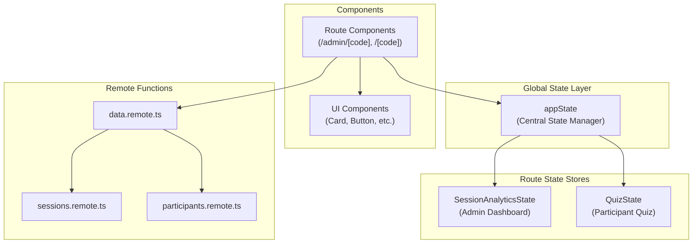

# Component and State Architecture

## 🎯 Current Architecture Overview

The application uses a **centralized state management** pattern with a global `appState` that bridges route-level stores.



## 📦 State Management Pattern

### Global AppState (`src/lib/state/app.ts`)

The centralized state manager that provides:

```typescript
export interface AppState {
	// UI State
	theme: 'light' | 'dark';
	toasts: Toast[];

	// Store Registry (bridges to route stores)
	getSessionStore: (code: string) => SessionAnalyticsState;
	clearSessionStore: (code: string) => void;
	getQuizState: (code: string) => RouteQuizState;
	clearQuizState: (code: string) => void;

	// UI Actions
	setTheme: (t: 'light' | 'dark') => void;
	showToast: (toast: Toast) => void;
	dismissToast: (id: string) => void;
}
```

### How Components Access State

```typescript
// In route components
import { appState } from '$lib/state/app';

// Get session-specific store
const store = appState.getSessionStore(sessionCode);

// Access reactive state
store.session; // Current session
store.participants; // List of participants
store.loading; // Loading state
```

## 🧩 Component System

### Current Component Structure

After consolidation, we have **3 unified components** replacing 11 duplicates:

1. **UnifiedCard** - Replaces Card, StatsCard, AnalyticsCard, ParticipantCard, QuestionCard
2. **UnifiedStatus** - Replaces StatusBadge, StatusIndicator
3. **UnifiedFeedback** - Replaces Loading, ErrorMessage, ErrorScreen, InvalidSession

### Component Import Pattern

The `src/lib/components/index.ts` currently exports aliases for backward compatibility:

```typescript
// Actual components
export { default as UnifiedCard } from './ui/UnifiedCard.svelte';
export { default as UnifiedStatus } from './ui/UnifiedStatus.svelte';
export { default as UnifiedFeedback } from './ui/UnifiedFeedback.svelte';

// Backward compatibility aliases (temporary)
export { default as Card } from './ui/UnifiedCard.svelte';
export { default as StatsCard } from './ui/UnifiedCard.svelte';
// ... etc
```

### Why Components Were "Broken"

The admin routes import `Card` which now points to `UnifiedCard`. The components aren't actually broken - they're using the unified component through aliases.

## 🔄 Data Flow Pattern

### 1. Session Creation

```
User → Admin UI → appState.getSessionStore() → sessions.remote.ts → Database
```

### 2. Real-time Updates

```
Database → SSE endpoint → Client subscription → Store update → UI re-render
```

### 3. Participant Interaction

```
User → Quiz UI → appState.getQuizState() → participants.remote.ts → Database
```

## 🏗️ Directory Structure Explained

```
src/
├── lib/
│   ├── state/              # Centralized state management
│   │   ├── app.ts          # Global appState
│   │   ├── context.ts      # Svelte context helpers
│   │   └── types.ts        # State type definitions
│   │
│   ├── components/         # UI Components
│   │   ├── ui/             # All UI components
│   │   │   ├── UnifiedCard.svelte    # Multi-variant card
│   │   │   ├── UnifiedStatus.svelte  # Multi-variant status
│   │   │   └── UnifiedFeedback.svelte # Multi-variant feedback
│   │   └── index.ts        # Component exports
│   │
│   └── utils/              # Utility functions
│
└── routes/                 # SvelteKit routes
    ├── admin/
    │   ├── admin.svelte.ts # SessionAnalyticsState
    │   └── [code]/         # Admin dashboard
    │
    └── [code]/
        ├── quiz.svelte.ts  # QuizState
        └── quiz/           # Quiz interface
```

## 🎨 Using Unified Components

### UnifiedCard Usage

```svelte
<!-- Default variant -->
<UnifiedCard>
	<p>Default card content</p>
</UnifiedCard>

<!-- Stats variant -->
<UnifiedCard variant="stats">
	<h3>Total Participants</h3>
	<p>42</p>
</UnifiedCard>

<!-- Analytics variant -->
<UnifiedCard variant="analytics">
	<!-- Chart components -->
</UnifiedCard>
```

### UnifiedFeedback Usage

```svelte
<!-- Loading state -->
<UnifiedFeedback type="loading" message="Loading session..." />

<!-- Error state -->
<UnifiedFeedback type="error" message={error} />

<!-- Empty state -->
<UnifiedFeedback type="empty" message="No participants yet" />
```

### UnifiedStatus Usage

```svelte
<!-- Badge variant -->
<UnifiedStatus variant="badge" status="active">Active</UnifiedStatus>

<!-- Indicator variant -->
<UnifiedStatus variant="indicator" status="completed" />

<!-- Dot variant -->
<UnifiedStatus variant="dot" status="pending" />
```

## 🔧 Migration Path

To complete the migration away from aliases:

1. **Update all imports** from `Card` to `UnifiedCard`
2. **Add variant props** where needed
3. **Remove aliases** from `index.ts`
4. **Test each route** to ensure proper rendering

## 🚀 Benefits of This Architecture

1. **Single Source of Truth**: Global appState manages all stores
2. **Type Safety**: Full TypeScript with proper interfaces
3. **Reduced Bundle Size**: 73% reduction in component code
4. **Maintainability**: Clear separation of concerns
5. **Performance**: Reactive Svelte 5 runes for efficient updates
6. **Flexibility**: Unified components with variants

## 🤝 Integration with Bits UI

If migrating to Bits UI components:

1. Replace unified components with Bits UI equivalents
2. Use Bits UI's unstyled components with Tailwind
3. Leverage Bits UI's accessibility features
4. Maintain the same state management pattern

The current architecture is already well-suited for Bits UI integration since both use:

- Component composition patterns
- Variant/prop-based customization
- Svelte 5 runes for reactivity
