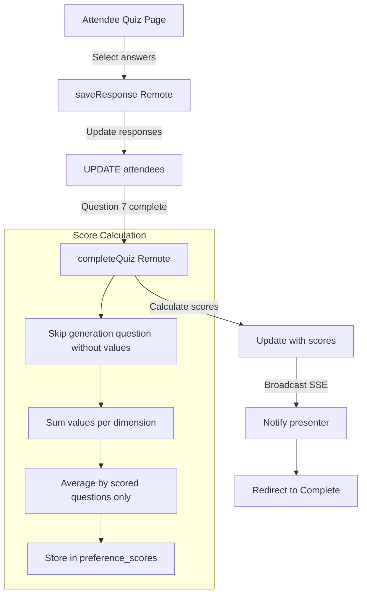
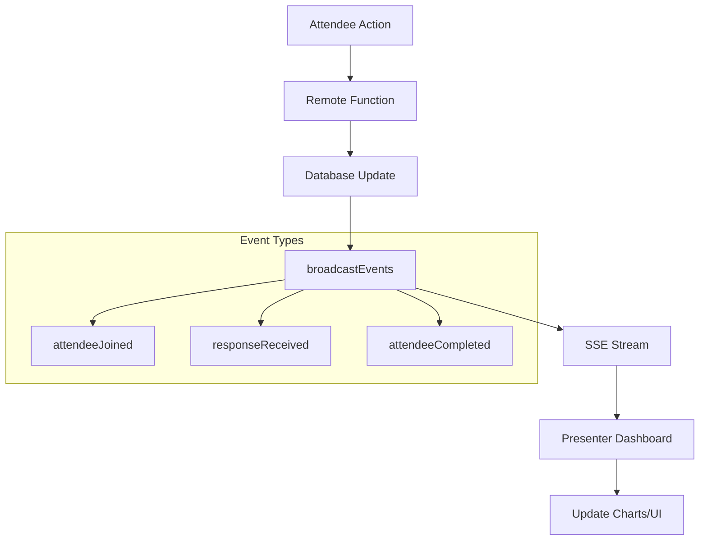
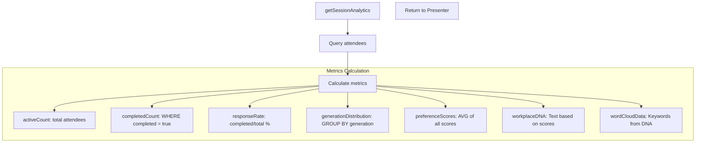

# Data Flow Documentation

## Database Schema

### Sessions Table
```sql
CREATE TABLE sessions (
    id          TEXT PRIMARY KEY,     -- CUID2 generated
    code        TEXT NOT NULL UNIQUE,  -- 8 char uppercase code (e.g., "TESTZT2L")
    name        TEXT NOT NULL,         -- Session title
    is_active   INTEGER DEFAULT true,  -- Active status
    created_at  TEXT DEFAULT CURRENT_TIMESTAMP,
    ended_at    TEXT                   -- When session ended
)
```

### Attendees Table
```sql
CREATE TABLE attendees (
    id                TEXT PRIMARY KEY,  -- CUID2 generated
    session_id        TEXT NOT NULL,     -- Foreign key to sessions
    name              TEXT NOT NULL,     -- Attendee name
    generation        TEXT,              -- Baby Boomer, Gen X, Millennial, Gen Z
    responses         TEXT DEFAULT '{}', -- JSON: {0: 'gen_z', 1: 'vibrant_lounge', ...}
    preference_scores TEXT,              -- JSON: {collaboration: 8, formality: 5, ...}
    completed         INTEGER DEFAULT false,
    joined_at         TEXT DEFAULT CURRENT_TIMESTAMP,
    completed_at      TEXT,
    FOREIGN KEY (session_id) REFERENCES sessions(id)
)
```

## 1. Session Creation Flow

```mermaid
graph TD
    A[Home Page] -->|User enters title| B[createSession Remote]
    B -->|Generate code: nanoid| C[Insert into DB]
    C -->|Return session| D[Redirect to Presenter]
    
    subgraph "Database Operation"
    C --> E[sessions.insert]
    E --> F[id: CUID2]
    E --> G[code: 8 chars]
    E --> H[name: title]
    end
    
    D --> I[/session/sessionId/presenter]
```

**Code Path:**
1. `src/routes/+page.svelte` - UI for title input
2. `src/routes/session/[sessionId]/presenter/presenter.remote.ts::createSession()` - Validates and creates session
3. Database insert with auto-generated ID and code
4. Returns redirect URL to presenter dashboard

## 2. Join Session Flow

```mermaid
graph TD
    A[Join Page/QR Scan] -->|Enter name| B[joinSession Remote]
    B -->|Find by code| C[Query sessions table]
    C -->|Session found| D[Create attendee]
    D -->|Insert attendee| E[Broadcast SSE]
    E --> F[Redirect to Quiz]
    
    subgraph "Database Operations"
    C --> G[SELECT * FROM sessions WHERE code = ?]
    D --> H[INSERT INTO attendees]
    H --> I[session_id, name, joined_at]
    end
    
    F --> J[/session/sessionId/attendee/attendeeId]
```

**Code Path:**
1. `src/routes/session/[sessionId]/join/+page.svelte` - Name input UI
2. `src/routes/session/[sessionId]/attendee/[attendeeId]/attendee.remote.ts::joinSession()` - Validates and creates attendee
3. Database: Find session by code, insert attendee
4. SSE broadcast: Notify presenter of new attendee
5. Redirect to quiz page

## 3. Quiz Completion Flow



**Code Path:**
1. `src/routes/session/[sessionId]/attendee/[attendeeId]/+page.svelte` - Quiz UI
2. `src/routes/session/[sessionId]/attendee/[attendeeId]/attendee.remote.ts::saveResponse()` - Save each answer
3. `src/routes/session/[sessionId]/attendee/[attendeeId]/attendee.remote.ts::completeQuiz()` - Calculate and save scores
4. SSE broadcast: Notify presenter of completion with scores
5. Redirect to completion page

**Database Updates:**
1. After each answer: `UPDATE attendees SET responses = ? WHERE id = ?`
2. Generation question (index 0): Also updates `generation` field
3. On completion: `UPDATE attendees SET completed = true, preference_scores = ?, completed_at = ?`

## 4. Real-time Updates (SSE)



**SSE Endpoint:** `/session/[sessionId]/stream/+server.ts`
- Maintains connection pool per session via SSE manager
- Broadcasts events to all connected clients
- Auto-reconnects on disconnect
- Events broadcast directly from remote functions (no API calls needed)

## 5. Analytics Aggregation



**Code:** `src/lib/stores/sessionState.svelte.ts::getAnalytics()` - Computed from reactive state

## Data Integrity Features

1. **Foreign Keys:** Attendees linked to sessions
2. **Unique Constraints:** Session codes are unique
3. **Default Values:** Timestamps, empty responses object
4. **JSON Validation:** Structured preference scores
5. **Transaction Safety:** Using Drizzle ORM transactions

## Performance Optimizations

1. **libSQL/SQLite:** Fast local database
2. **Indexed columns:** Primary keys auto-indexed
3. **JSON storage:** Efficient for flexible quiz responses
4. **SSE over WebSockets:** Lower overhead for one-way updates
5. **Query optimization:** Single queries where possible

## Security Considerations

1. **Input Validation:** Valibot schemas on all remote functions
2. **SQL Injection Prevention:** Parameterized queries via Drizzle
3. **Session Isolation:** Attendees can only access their session
4. **No PII Storage:** Only names and preferences stored
5. **Read-only Analytics:** Presenters can't modify attendee data