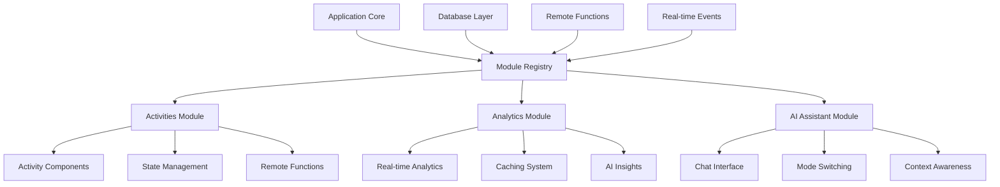

# Module System Architecture

The Zyeta DX platform uses a sophisticated module system to organize functionality into reusable, maintainable components. This document provides a comprehensive overview of the architecture, module creation process, and best practices.

## Table of Contents

- [Architecture Overview](#architecture-overview)
- [Module Types](#module-types)
- [Module Creation Guide](#module-creation-guide)
- [API Reference](#api-reference)
- [Best Practices](#best-practices)
- [Examples](#examples)
- [Testing Modules](#testing-modules)
- [Deployment](#deployment)

## Architecture Overview

The module system is built on three core principles:

1. **Modularity** - Isolated, reusable components with clear interfaces
2. **Extensibility** - Plugin-based architecture for adding new functionality
3. **Type Safety** - Full TypeScript support with runtime validation



### Core Components

- **Module Registry** - Central registration and discovery system
- **Type System** - Shared types and interfaces for all modules
- **Remote Functions** - Server-side API integration
- **State Management** - Reactive state with Svelte 5 runes
- **Component System** - Reusable UI components

## Module Types

### 1. Activity Modules (`src/lib/modules/activities/`)

Interactive components for session engagement (polls, surveys, brainstorming).

**Key Features:**

- Plugin-based architecture for easy extension
- Real-time participant interaction
- Built-in result aggregation and analysis
- Mobile-responsive UI components

**Structure:**

```
activities/
├── README.md              # Module documentation
├── types.ts              # Core interfaces and types
├── registry.ts           # Activity registration system
├── poll/                 # Example poll activity
│   ├── index.ts         # Module definition
│   ├── PollComponent.svelte
│   ├── PollResults.svelte
│   └── state.ts         # Activity state management
└── quiz/                # Example quiz activity
    ├── index.ts
    ├── QuizComponent.svelte
    └── scoring.ts
```

### 2. Analytics Module (`src/lib/modules/analytics/`)

Real-time analytics, insights generation, and reporting capabilities.

**Key Features:**

- Performance-optimized caching system
- AI-powered insights generation
- Real-time dashboard updates
- Multiple export formats (JSON, CSV, Excel)

**Structure:**

```
analytics/
├── README.md              # Module documentation
├── types.ts              # Analytics type definitions
├── engine.ts             # Core analytics engine
├── cache.ts              # Caching strategy implementation
├── insights.ts           # AI insights generation
├── components/           # Analytics UI components
│   ├── PreferenceRadar.svelte
│   ├── GenerationChart.svelte
│   └── InsightCard.svelte
└── exporters/            # Data export utilities
    ├── json.ts
    ├── csv.ts
    └── excel.ts
```

### 3. AI Assistant Module (`src/lib/modules/ai-assistant/`)

Intelligent chat assistant with context-aware responses and multiple specialized modes.

**Key Features:**

- Multiple AI modes (Brainstorm, Layout, Environment, General)
- Context-aware responses based on session data
- Graceful fallbacks when AI services are unavailable
- Full accessibility support

**Structure:**

```
ai-assistant/
├── README.md              # Module documentation
├── ZyetaIAssistant.svelte # Main component
├── types.ts              # AI assistant types
├── contexts/             # AI context generators
│   ├── brainstorm.ts
│   ├── layout.ts
│   ├── environment.ts
│   └── general.ts
└── fallbacks/            # Fallback responses
    └── responses.ts
```

## Module Creation Guide

### Step 1: Define Module Structure

Create a new directory under `src/lib/modules/` with the following structure:

```bash
mkdir src/lib/modules/your-module
cd src/lib/modules/your-module

# Create base files
touch README.md
touch index.ts
touch types.ts
mkdir components
mkdir utils
```

### Step 2: Define Types

Create comprehensive TypeScript interfaces in `types.ts`:

```typescript
// src/lib/modules/your-module/types.ts

/**
 * Core module configuration
 */
export interface YourModuleConfig {
	id: string;
	name: string;
	version: string;
	description?: string;
	dependencies?: string[];
	settings?: Record<string, any>;
}

/**
 * Module state interface
 */
export interface YourModuleState {
	readonly isInitialized: boolean;
	readonly isActive: boolean;
	readonly config: YourModuleConfig;
	readonly data: any;

	init(): Promise<void>;
	destroy(): void;
	update(data: any): void;
}

/**
 * Module API interface
 */
export interface YourModuleAPI {
	createState(config: YourModuleConfig): YourModuleState;
	validateConfig(config: Partial<YourModuleConfig>): boolean;
	getDefaultConfig(): YourModuleConfig;
}
```

### Step 3: Implement Core Logic

Create the main module implementation in `index.ts`:

```typescript
// src/lib/modules/your-module/index.ts

import type { YourModuleConfig, YourModuleState, YourModuleAPI } from './types';
import YourModuleComponent from './components/YourModuleComponent.svelte';

/**
 * Module state implementation
 */
export function createYourModuleState(config: YourModuleConfig): YourModuleState {
	let isInitialized = $state(false);
	let isActive = $state(false);
	let moduleConfig = $state(config);
	let data = $state({});

	return {
		get isInitialized() {
			return isInitialized;
		},
		get isActive() {
			return isActive;
		},
		get config() {
			return moduleConfig;
		},
		get data() {
			return data;
		},

		async init() {
			try {
				// Initialize module resources
				await initializeResources();
				isInitialized = true;
				console.log(`Module ${config.name} initialized`);
			} catch (error) {
				console.error(`Failed to initialize module ${config.name}:`, error);
				throw error;
			}
		},

		destroy() {
			// Clean up resources
			cleanup();
			isInitialized = false;
			isActive = false;
		},

		update(newData: any) {
			data = { ...data, ...newData };
		}
	};
}

/**
 * Module API implementation
 */
export const yourModuleAPI: YourModuleAPI = {
	createState: createYourModuleState,

	validateConfig(config: Partial<YourModuleConfig>): boolean {
		return !!(config.id && config.name && config.version);
	},

	getDefaultConfig(): YourModuleConfig {
		return {
			id: 'your-module',
			name: 'Your Module',
			version: '1.0.0',
			description: 'A sample module implementation'
		};
	}
};

/**
 * Module component export
 */
export { default as YourModuleComponent } from './components/YourModuleComponent.svelte';

// Helper functions
async function initializeResources() {
	// Module-specific initialization logic
}

function cleanup() {
	// Module-specific cleanup logic
}
```

### Step 4: Create UI Components

Develop Svelte components in the `components/` directory:

```svelte
<!-- src/lib/modules/your-module/components/YourModuleComponent.svelte -->
<script lang="ts">
	import type { YourModuleState } from '../types';

	interface Props {
		state: YourModuleState;
		onUpdate?: (data: any) => void;
	}

	let { state, onUpdate }: Props = $props();

	// Reactive values
	let isLoading = $state(false);
	let error = $state<string | null>(null);

	// Initialize on mount
	$effect(async () => {
		if (!state.isInitialized) {
			isLoading = true;
			try {
				await state.init();
			} catch (err) {
				error = err.message;
			} finally {
				isLoading = false;
			}
		}
	});

	// Handle updates
	function handleUpdate(newData: any) {
		state.update(newData);
		onUpdate?.(newData);
	}
</script>

<div class="your-module">
	<header class="module-header">
		<h2>{state.config.name}</h2>
		<p>{state.config.description}</p>
	</header>

	{#if isLoading}
		<div class="loading">
			<div class="spinner"></div>
			<p>Initializing module...</p>
		</div>
	{:else if error}
		<div class="error">
			<p>Error: {error}</p>
			<button onclick={() => (error = null)}>Dismiss</button>
		</div>
	{:else if state.isInitialized}
		<div class="module-content">
			<!-- Your module UI here -->
			<slot />
		</div>
	{:else}
		<div class="not-initialized">
			<p>Module not initialized</p>
		</div>
	{/if}
</div>

<style>
	.your-module {
		padding: 1rem;
		border: 1px solid #e5e7eb;
		border-radius: 0.5rem;
		background: white;
	}

	.module-header {
		margin-bottom: 1rem;
		padding-bottom: 1rem;
		border-bottom: 1px solid #e5e7eb;
	}

	.module-header h2 {
		margin: 0 0 0.5rem 0;
		color: #1f2937;
	}

	.module-header p {
		margin: 0;
		color: #6b7280;
	}

	.loading,
	.error,
	.not-initialized {
		text-align: center;
		padding: 2rem;
	}

	.spinner {
		width: 2rem;
		height: 2rem;
		border: 2px solid #e5e7eb;
		border-top: 2px solid #3b82f6;
		border-radius: 50%;
		animation: spin 1s linear infinite;
		margin: 0 auto 1rem;
	}

	@keyframes spin {
		to {
			transform: rotate(360deg);
		}
	}

	.error {
		color: #dc2626;
	}

	.error button {
		margin-top: 1rem;
		padding: 0.5rem 1rem;
		background: #dc2626;
		color: white;
		border: none;
		border-radius: 0.25rem;
		cursor: pointer;
	}
</style>
```

### Step 5: Add Remote Functions Integration

Create server-side functions for data persistence and processing:

```typescript
// src/routes/your-module.remote.ts
import { command, query } from '$app/server';
import * as v from 'valibot';
import type { YourModuleConfig } from '$lib/modules/your-module/types';

/**
 * Create a new module instance
 */
export const createModuleInstance = command(
	v.object({
		config: v.object({
			id: v.string(),
			name: v.string(),
			version: v.string(),
			settings: v.optional(v.record(v.string(), v.any()))
		})
	}),
	async ({ config }) => {
		try {
			// Store module configuration in database
			const instance = await db.insert(moduleInstances).values({
				id: generateId(),
				config: JSON.stringify(config),
				createdAt: new Date().toISOString()
			});

			return { success: true, instanceId: instance.id };
		} catch (error) {
			console.error('Failed to create module instance:', error);
			return { success: false, error: error.message };
		}
	}
);

/**
 * Get module data
 */
export const getModuleData = query(
	v.object({
		instanceId: v.string()
	}),
	async ({ instanceId }) => {
		const instance = await db
			.select()
			.from(moduleInstances)
			.where(eq(moduleInstances.id, instanceId))
			.limit(1);

		if (instance.length === 0) {
			throw new Error('Module instance not found');
		}

		return {
			config: JSON.parse(instance[0].config),
			data: JSON.parse(instance[0].data || '{}'),
			lastUpdated: instance[0].updatedAt
		};
	}
);

/**
 * Update module data
 */
export const updateModuleData = command(
	v.object({
		instanceId: v.string(),
		data: v.record(v.string(), v.any())
	}),
	async ({ instanceId, data }) => {
		await db
			.update(moduleInstances)
			.set({
				data: JSON.stringify(data),
				updatedAt: new Date().toISOString()
			})
			.where(eq(moduleInstances.id, instanceId));

		return { success: true };
	}
);
```

### Step 6: Write Documentation

Create comprehensive documentation in `README.md`:

````markdown
# Your Module

Brief description of what your module does and its primary use cases.

## Features

- Feature 1: Description
- Feature 2: Description
- Feature 3: Description

## Installation

```typescript
import { yourModuleAPI, YourModuleComponent } from '$lib/modules/your-module';
```
````

## Usage

### Basic Usage

```svelte
<script>
	import { YourModuleComponent } from '$lib/modules/your-module';
	import { yourModuleAPI } from '$lib/modules/your-module';

	const config = yourModuleAPI.getDefaultConfig();
	const state = yourModuleAPI.createState(config);
</script>

<YourModuleComponent {state} />
```

## API Reference

### Types

[Document all TypeScript interfaces]

### Methods

[Document all public methods]

### Events

[Document all events the module emits]

## Examples

[Provide practical examples]

## Testing

[Document how to test the module]

````

## API Reference

### Core Interfaces

All modules should implement these core interfaces:

```typescript
// Module configuration
interface ModuleConfig {
  id: string;
  name: string;
  version: string;
  description?: string;
  dependencies?: string[];
  metadata?: Record<string, any>;
}

// Module lifecycle
interface ModuleLifecycle {
  init(): Promise<void>;
  start(): void;
  stop(): void;
  destroy(): void;
}

// Module registry
interface ModuleRegistry {
  register(module: Module): void;
  unregister(id: string): void;
  get(id: string): Module | undefined;
  list(): Module[];
  isRegistered(id: string): boolean;
}
````

### State Management

Modules use Svelte 5 runes for reactive state:

```typescript
function createModuleState<T>(initialData: T) {
	let data = $state(initialData);
	let loading = $state(false);
	let error = $state<string | null>(null);

	return {
		get data() {
			return data;
		},
		get loading() {
			return loading;
		},
		get error() {
			return error;
		},

		setData(newData: T) {
			data = newData;
		},

		setLoading(isLoading: boolean) {
			loading = isLoading;
		},

		setError(errorMessage: string | null) {
			error = errorMessage;
		}
	};
}
```

### Remote Functions Integration

All server-side operations should use SvelteKit's remote functions:

```typescript
// Query for read operations
export const getModuleData = query(v.object({ id: v.string() }), async ({ id }) => {
	// Read data from database
	return { data: result };
});

// Command for write operations
export const updateModuleData = command(
	v.object({ id: v.string(), data: v.any() }),
	async ({ id, data }) => {
		// Write data to database
		return { success: true };
	}
);
```

## Best Practices

### 1. Module Design

- **Single Responsibility** - Each module should have one clear purpose
- **Loose Coupling** - Minimize dependencies between modules
- **High Cohesion** - Keep related functionality together
- **Clear Interface** - Provide well-defined public APIs

### 2. State Management

- **Use Svelte 5 Runes** - Leverage `$state`, `$derived`, `$effect` for reactivity
- **Immutable Updates** - Always create new objects instead of mutating existing ones
- **Proper Cleanup** - Always clean up resources in lifecycle methods
- **Error Handling** - Handle errors gracefully with user-friendly messages

### 3. Component Development

- **Props Interface** - Always define TypeScript interfaces for component props
- **Accessibility** - Include proper ARIA labels and keyboard navigation
- **Responsive Design** - Ensure components work on all screen sizes
- **Performance** - Optimize for performance with proper memoization

### 4. Testing

- **Unit Tests** - Test individual functions and components
- **Integration Tests** - Test module integration with other systems
- **E2E Tests** - Test complete user workflows
- **Type Checking** - Use TypeScript strict mode

```typescript
// Example unit test
import { describe, it, expect } from 'vitest';
import { yourModuleAPI } from '../index';

describe('YourModule', () => {
	it('validates config correctly', () => {
		const validConfig = {
			id: 'test',
			name: 'Test Module',
			version: '1.0.0'
		};

		expect(yourModuleAPI.validateConfig(validConfig)).toBe(true);
	});

	it('creates state with default config', () => {
		const defaultConfig = yourModuleAPI.getDefaultConfig();
		const state = yourModuleAPI.createState(defaultConfig);

		expect(state.config).toEqual(defaultConfig);
		expect(state.isInitialized).toBe(false);
	});
});
```

### 5. Documentation

- **README Files** - Comprehensive documentation for each module
- **Code Comments** - JSDoc comments for all public APIs
- **Examples** - Practical examples showing real usage
- **Migration Guides** - When updating modules, provide migration instructions

### 6. Performance

- **Lazy Loading** - Load modules only when needed
- **Code Splitting** - Split large modules into smaller chunks
- **Caching** - Cache expensive computations and network requests
- **Bundle Optimization** - Use tree-shaking and minification

```typescript
// Lazy loading example
const lazyLoadModule = async () => {
	const module = await import('./heavy-module');
	return module.default;
};
```

## Examples

### Complete Examples

The `src/lib/modules/examples/` directory contains comprehensive examples:

1. **[Basic Activity](../src/lib/modules/examples/basic-activity.svelte)** - Simple yes/no poll implementation
2. **[Analytics Dashboard](../src/lib/modules/examples/analytics-dashboard.svelte)** - Real-time analytics integration
3. **[Complete Session](../src/lib/modules/examples/complete-session.svelte)** - Full session workflow with multiple modules

### Quick Start Example

```svelte
<!-- MyPage.svelte -->
<script lang="ts">
	import { YourModuleComponent } from '$lib/modules/your-module';
	import { yourModuleAPI } from '$lib/modules/your-module';

	// Create module state
	const config = yourModuleAPI.getDefaultConfig();
	const state = yourModuleAPI.createState(config);

	// Handle module updates
	function handleModuleUpdate(data: any) {
		console.log('Module updated:', data);
	}
</script>

<div class="page">
	<h1>My Module Demo</h1>

	<YourModuleComponent {state} onUpdate={handleModuleUpdate} />
</div>
```

## Testing Modules

### Unit Testing

```bash
# Run tests for specific module
npm test -- src/lib/modules/your-module

# Run all module tests
npm test -- src/lib/modules
```

### Integration Testing

```typescript
// Integration test example
import { render, fireEvent } from '@testing-library/svelte';
import YourModuleComponent from '../components/YourModuleComponent.svelte';
import { yourModuleAPI } from '../index';

describe('YourModule Integration', () => {
	it('renders and initializes correctly', async () => {
		const config = yourModuleAPI.getDefaultConfig();
		const state = yourModuleAPI.createState(config);

		const { getByText, getByRole } = render(YourModuleComponent, {
			props: { state }
		});

		// Wait for initialization
		await state.init();

		expect(getByText(config.name)).toBeInTheDocument();
		expect(state.isInitialized).toBe(true);
	});
});
```

### E2E Testing

```typescript
// Playwright E2E test
import { test, expect } from '@playwright/test';

test('module workflow', async ({ page }) => {
	await page.goto('/modules/your-module');

	// Test module initialization
	await expect(page.getByText('Your Module')).toBeVisible();

	// Test user interactions
	await page.click('button[data-testid="module-action"]');
	await expect(page.getByText('Module activated')).toBeVisible();
});
```

## Deployment

### Production Considerations

1. **Environment Variables** - Configure module settings via environment variables
2. **Error Monitoring** - Integrate with error tracking services
3. **Performance Monitoring** - Track module performance metrics
4. **Graceful Degradation** - Handle service failures gracefully

### Build Configuration

```javascript
// vite.config.ts
export default defineConfig({
	build: {
		rollupOptions: {
			output: {
				manualChunks: {
					'modules-activities': ['src/lib/modules/activities'],
					'modules-analytics': ['src/lib/modules/analytics'],
					'modules-ai-assistant': ['src/lib/modules/ai-assistant']
				}
			}
		}
	}
});
```

### Environment Setup

```env
# Module-specific environment variables
YOUR_MODULE_API_URL=https://api.example.com
YOUR_MODULE_API_KEY=your-api-key
YOUR_MODULE_CACHE_TTL=3600
YOUR_MODULE_DEBUG=false
```

---

This module system provides a robust foundation for building scalable, maintainable workplace intelligence applications. Each module is designed to be independent yet integrated, allowing for easy development, testing, and deployment of new features.
