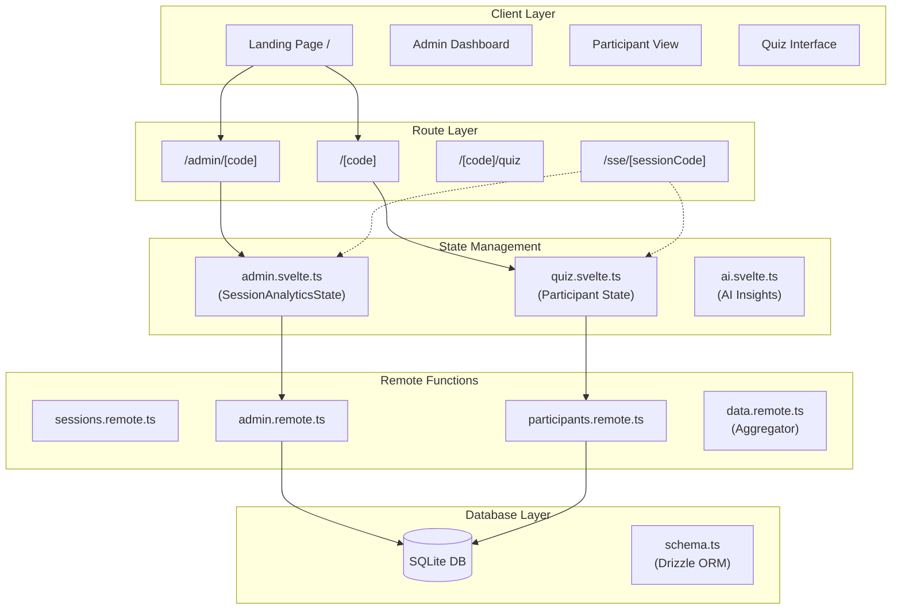
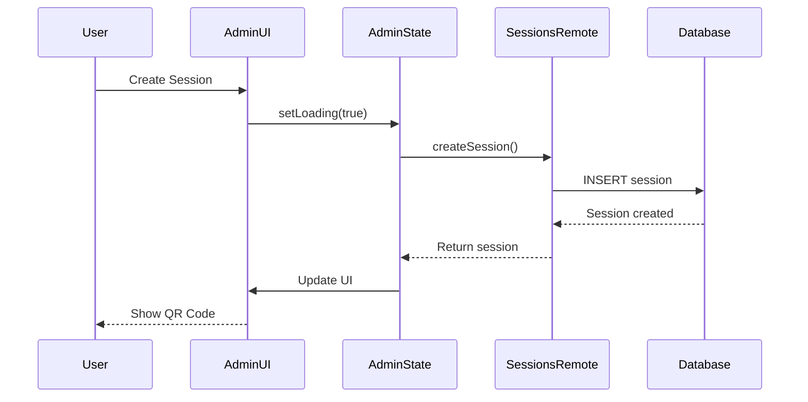
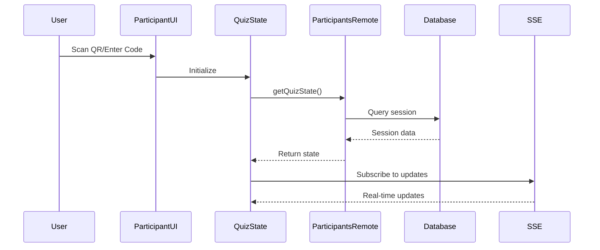
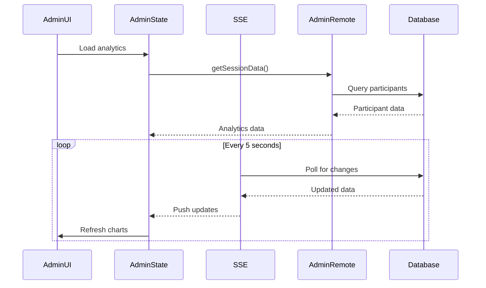

# System Architecture & Data Flow

## 🏗️ Overall Architecture



## 📊 Data Flow Patterns

### 1. Session Creation Flow



### 2. Participant Join Flow



### 3. Real-time Analytics Flow



## 🗂️ Directory Structure

```
src/
├── routes/                     # SvelteKit Routes
│   ├── +page.svelte            # Landing page
│   ├── admin/                  # Admin routes
│   │   ├── admin.svelte.ts     # Admin state management
│   │   ├── admin.remote.ts     # Admin server functions
│   │   ├── ai.svelte.ts        # AI insights state
│   │   └── [code]/             # Session analytics page
│   ├── [code]/                 # Participant routes
│   │   ├── quiz.svelte.ts      # Quiz state
│   │   └── quiz/               # Quiz interface
│   ├── sessions/               # Session operations
│   │   └── sessions.remote.ts
│   ├── participants/           # Participant operations
│   │   └── participants.remote.ts
│   └── sse/                    # Server-sent events
│       └── [sessionCode]/
│
├── lib/
│   ├── components/             # UI Components
│   │   ├── ui/                 # Unified components
│   │   │   ├── UnifiedCard.svelte
│   │   │   ├── UnifiedStatus.svelte
│   │   │   └── UnifiedFeedback.svelte
│   │   └── charts/             # Chart components
│   ├── server/                 # Server utilities
│   │   └── db/
│   │       └── schema.ts       # Database schema
│   ├── state/                  # State management
│   │   ├── base-store.ts
│   │   ├── create-store.ts
│   │   └── types.ts
│   └── utils/                  # Utilities
│       ├── validation.ts
│       ├── scoring.ts
│       └── analysis.ts
```

## 🔴 Current Issues

### 1. **Broken Component Imports**

The admin routes are importing from `$lib/components` which doesn't have an index.ts file exporting the components.

**Files affected:**

- `src/routes/admin/[code]/+page.svelte`
- `src/routes/admin/+page.svelte`
- `src/routes/admin/(components)/StatsGrid.svelte`

**Problem:**

```typescript
import { Card, Button, ConfirmationDialog } from '$lib/components';
// ❌ This fails because there's no index.ts exporting these
```

**Solution:**

```typescript
import Card from '$lib/components/ui/UnifiedCard.svelte';
import Button from '$lib/components/ui/Button.svelte';
import ConfirmationDialog from '$lib/components/ui/ConfirmationDialog.svelte';
// ✅ Direct imports work
```

### 2. **Missing Components**

Some components were deleted during consolidation but are still being imported:

- `Card` → Should use `UnifiedCard`
- `StatsCard` → Should use `UnifiedCard` with `variant="stats"`
- `Loading` → Should use `UnifiedFeedback` with `type="loading"`

## 🔄 State Management Pattern

```typescript
// 1. Route creates/gets state instance
const store = getSessionStore(sessionCode);

// 2. State manages reactive data
class SessionAnalyticsState {
    session = $state<Session | null>(null);
    participants = $state<Participant[]>([]);

    // Derived computations
    activeCount = $derived(this.participants.filter(p => !p.completed).length);
}

// 3. Remote functions handle server operations
export const getSessionData = query(
    v.object({ sessionCode: v.string() }),
    async ({ sessionCode }) => {
        // Database operations
    }
);

// 4. Components consume state reactively
{#if store.loading}
    <UnifiedFeedback type="loading" />
{:else if store.error}
    <UnifiedFeedback type="error" message={store.error} />
{:else}
    <UnifiedCard variant="stats">
        <!-- Content -->
    </UnifiedCard>
{/if}
```

## 🎯 Key Design Principles

1. **Unidirectional Data Flow**: UI → State → Remote → Database
2. **Reactive State**: Using Svelte 5 runes for automatic updates
3. **Type Safety**: TypeScript interfaces and Valibot validation
4. **Component Reusability**: Unified components with variants
5. **Real-time Updates**: SSE for live data synchronization
6. **No Authentication**: Cookie-based anonymous tracking

## 🚀 Recommended Fixes

1. **Create component index file**:

   ```typescript
   // src/lib/components/index.ts
   export { default as Button } from './ui/Button.svelte';
   export { default as UnifiedCard } from './ui/UnifiedCard.svelte';
   export { default as UnifiedStatus } from './ui/UnifiedStatus.svelte';
   export { default as UnifiedFeedback } from './ui/UnifiedFeedback.svelte';
   export { default as ConfirmationDialog } from './ui/ConfirmationDialog.svelte';
   ```

2. **Update imports in admin routes**:
   - Replace `Card` with `UnifiedCard`
   - Replace `StatsCard` with `UnifiedCard variant="stats"`
   - Fix all component imports to use proper paths

3. **Consolidate remote function exports**:
   - Keep domain-specific remote files
   - Use `data.remote.ts` as aggregator only
